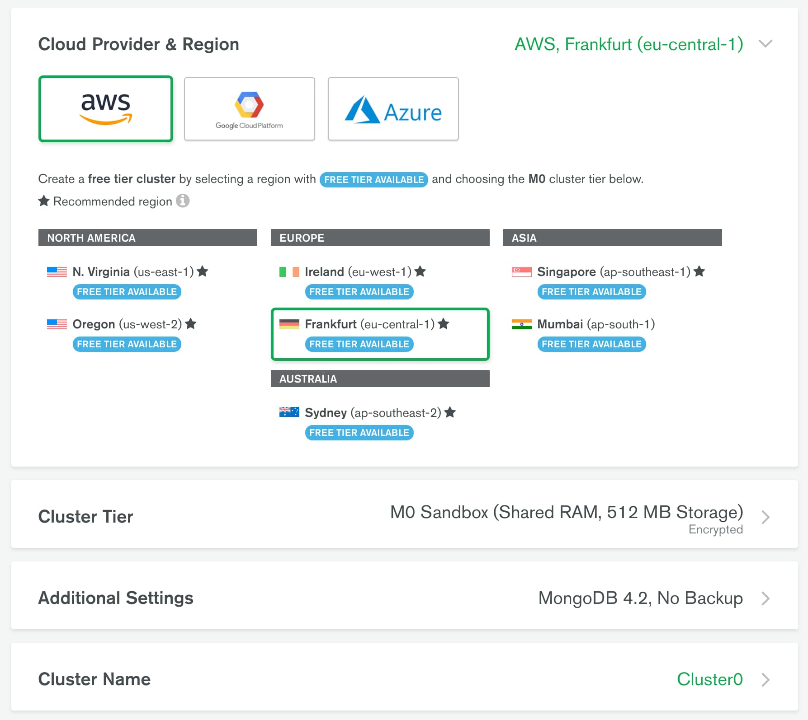

# Homework 03 - Rest API | MongoDB | Mongoose

Продовж створення REST API для роботи з колекцією контактів.

Створи гілку `hw03-mongodb` з гілки `master`.

## Крок 1

Створи аккаунт на [MongoDB Atlas](https://www.mongodb.com/cloud/atlas). Після
чого в акаунті створи новий проект і налаштуй **безкоштовний кластер**. Під час
налаштування кластера вибери провайдера і регіон як на скріншоті нижче. Якщо
вибрати занадто віддалений регіон, швидкість відповіді сервера буде довше.



## Крок 2

Встанови графічний редактор
[MongoDB Compass](https://www.mongodb.com/download-center/compass) для зручної
роботи з базою даних для MongoDB. Налаштуй підключення своєї хмарної бази даних
до Compass. У MongoDB Atlas не забудь створити користувача з правами
адміністратора.

## Крок 3

Через Compass створи базу даних `db-contacts` і в ній колекцію contacts. Візьми
[посилання на json](https://downgit.github.io/#/home?url=https://github.com/goitacademy/nodejs-homework/blob/master/homework-03/contacts.json)
і за допомогою Compass наповни колекцію contacts (зроби імпорт) його вмістом.


Якщо ви все зробили правильно, дані повинні з'явитися у вашій базі в колекції
`contacts`


## Крок 4

Використовуй вихідний код **домашньої работи #2** і заміни зберігання контактів
з json-файлу на створену тобою базу даних.

- Напиши код для створення підключення до MongoDB за допомогою
  [Mongoose](https://mongoosejs.com/).
- При успішному підключенні виведи в консоль повідомлення
  `"Database connection successful"`.
- Обов'язково обробив помилку підключення. Виведи в консоль повідомлення помилки
  і заверши процес використовуючи `process.exit(1)`.
- У функціях обробки запитів заміни код CRUD-операцій над контактами з файлу, на
  Mongoose-методи для роботи з колекцією контактів в базі даних.

Схема моделі для колекції contacts:

```js
{
    name: {
        type: String,
        required: [true, 'Set name for contact'],
    },
    email: {
        type: String,
    },
    phone: {
        type: String,
    },
    favorite: {
        type: Boolean,
        default:false,
    },
}
```

## Крок 5

У нас з'явилося в контактах додаткове поле статусу `favorite`, яке приймає
логічне значення `true` або `false`. Воно відповідає за те, що в обраному чи ні
знаходиться зазначений контакт. Потрібно реалізувати для оновлення статусу
контакту новий роутер

### @ PATCH / api / contacts /: contactId / favorite

- Отримує параметр `contactId`
- Отримує `body` в json-форматі c оновленням поля `favorite`
- Якщо `body` немає, повертає json з ключем
  `{"message": "missing field favorite"}` і статусом `400`
- Якщо з `body` все добре, викликає функцію
  `updateStatusContact (contactId, body)` (напиши її для поновлення контакту в
  базі)
- За результатом роботи функції повертає оновлений об'єкт контакту і статусом
  `200`. В іншому випадку, повертає json з ключем `" message ":" Not found "` і
  статусом `404`

Для роута `POST /api/contacts` внеси зміни: якщо поле `favorite` не вказали в
`body`, то при збереженні в базу нового контакту, зроби поле `favorite` рівним
за замовчуванням `false`
